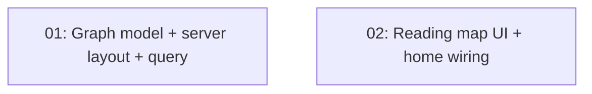

# Genre Constellation

## Overview

A "Your reading map" card on the home page: a concept map of genres and the books (library + wishlist) connected to them, with a static preview and an interactive full-size dialog.

## Quick Links

- [Requirements](./requirements.md)
- [Action Required](./action-required.md)

## Dependency Graph

Both tasks run in parallel against the type contract written into each task file; the wave review checks they meet.

## Waves

| Wave | Tasks | Description |
|------|-------|-------------|
| 1 | task-01, task-02 | Data/layout and UI in parallel |

## Task Status

### Wave 1
- [x] [task-01-graph-layout](./tasks/task-01-graph-layout.md) — Graph model, d3-force layout, query
- [x] [task-02-reading-map-ui](./tasks/task-02-reading-map-ui.md) — Reading map card, dialog, home wiring
