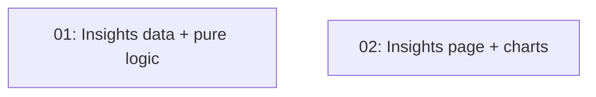

# Insights page

## Overview

A `/insights` page with three charts about the reader's shelf: eras read (publication decades), genres as bubbles (rating × books read, with pending rings), and their own rating distribution — with an All time / year toggle.

## Quick Links

- [Requirements](./requirements.md)
- [Action Required](./action-required.md)

## Dependency Graph

Both run in parallel against the type contract written into each task file.

## Waves

| Wave | Tasks | Description |
|------|-------|-------------|
| 1 | task-01, task-02 | Data/logic and page/charts in parallel |

## Task Status

### Wave 1
- [x] [task-01-insights-data](./tasks/task-01-insights-data.md) — Query + pure insight builders with tests
- [x] [task-02-insights-page](./tasks/task-02-insights-page.md) — Page, charts, nav link
