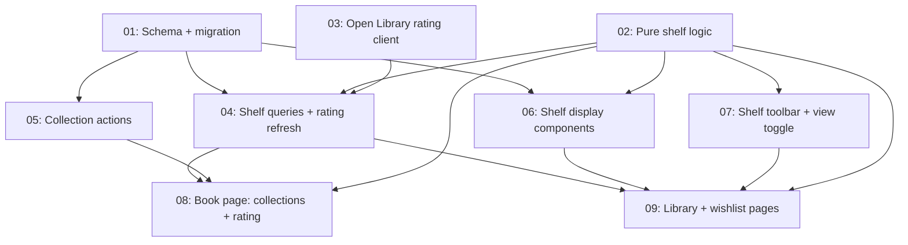

# Shelves Refresh

## Overview

Makes the Library and Wishlist pages worth browsing: year-grouped library with summaries, single-book highlights, status chips with counts, subject/author/collection filters, a cover-wall view, Open Library community ratings on the wishlist, and user collections managed from the book page.

## Quick Links

- [Requirements](./requirements.md) — full requirements and acceptance criteria
- [Action Required](./action-required.md) — manual steps needing human action

## Dependency Graph

## Waves

| Wave | Tasks | Description |
|------|-------|-------------|
| 1 | task-01, task-02, task-03 | Schema, pure logic, external rating client |
| 2 | task-04, task-05, task-06, task-07 | Data layer, actions, display components, toolbar |
| 3 | task-08, task-09 | Wire up book page and shelf pages |

Transient type errors between waves are expected: task-02 adds a `community` sort key that `queries.ts` handles only after task-04, and task-07 changes the `ShelfToolbar` props that the pages adopt in task-09. Full `pnpm typecheck` / `pnpm build:ci` must pass after Wave 3.

## Task Status

### Wave 1
- [x] [task-01-schema-migration](./tasks/task-01-schema-migration.md) — Schema + migration
- [x] [task-02-shelf-logic](./tasks/task-02-shelf-logic.md) — Pure shelf logic (filters, counts, groups, highlights)
- [x] [task-03-openlibrary-rating](./tasks/task-03-openlibrary-rating.md) — Open Library community rating client

### Wave 2
- [x] [task-04-queries-ratings](./tasks/task-04-queries-ratings.md) — Shelf view queries + background rating refresh
- [x] [task-05-collection-actions](./tasks/task-05-collection-actions.md) — Collection server actions
- [x] [task-06-shelf-components](./tasks/task-06-shelf-components.md) — Book card, community rating, highlights, shelf grid
- [x] [task-07-shelf-toolbar](./tasks/task-07-shelf-toolbar.md) — Status chips, filters, view toggle

### Wave 3
- [x] [task-08-book-page](./tasks/task-08-book-page.md) — Book page: collections picker, rating fact, author link
- [x] [task-09-shelf-pages](./tasks/task-09-shelf-pages.md) — Library + wishlist pages
